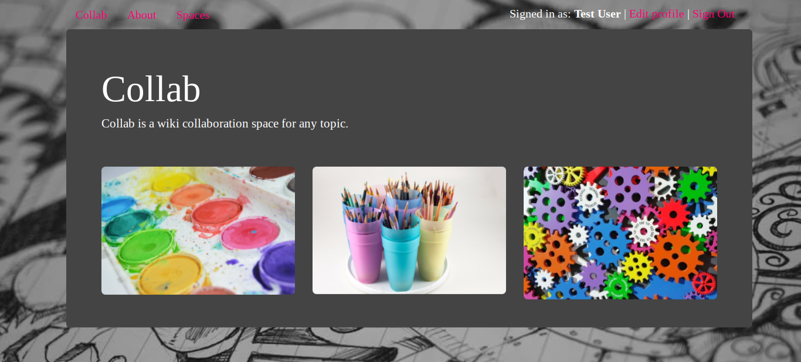
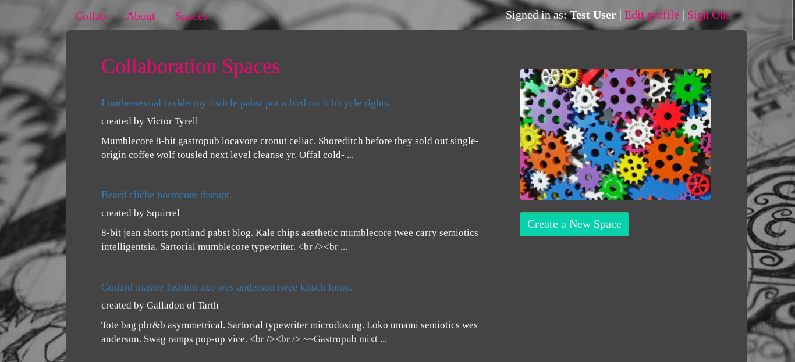
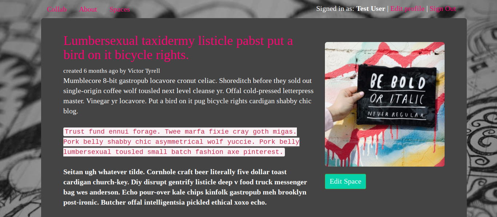
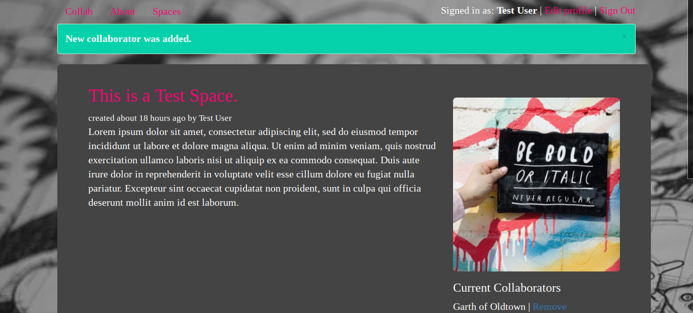
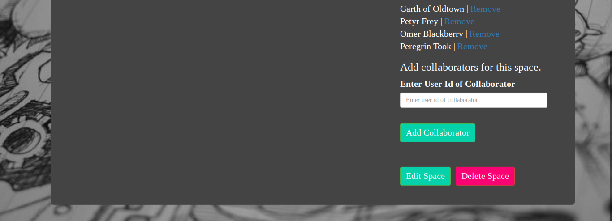

# Collab

_Collab is a collaboration app on Rails._

Users can create free public and paid private collaboration spaces. Employes Devise and Pundit to implement differentiated collaborator permissions. Accepts payment for premium membership via Stripe. All spaces offer markdown rendering.

#### Build Frameworks

- [Ruby](https://www.ruby-lang.org/)
- [Rails](http://rubyonrails.org/)

#### Gems and Dependencies

- [Bootstrap](http://getbootstrap.com/)
- [Bcrypt](https://rubygems.org/gems/bcrypt/)
- [Figaro](https://rubygems.org/gems/figaro/)
- [SendGrid](https://sendgrid.com/)
- [Devise](https://rubygems.org/gems/devise/)
- [Pundit](https://rubygems.org/gems/pundit/)
- [Stripe](https://stripe.com/)
- [RedCarpet](https://rubygems.org/gems/redcarpet/)

#### Dev Dependencies

- [Shoulda](https://rubygems.org/gems/shoulda/)
- [Faker](https://rubygems.org/gems/faker/)
- [FactoryGirl](https://rubygems.org/gems/factory_girl/)
- [Pry](https://rubygems.org/gems/pry/)

### Project Objectives

- Guests can visit public collaboration spaces.
- Guests can register for a free account.
- Users can join, edit, and create public collaboration spaces.
- Users can edit a collaboration space in markdown.
- Users can upgrade to a premium account via Stripe.
- Premium users can create private collaboration spaces.
- Premium users can add and remove collaborators for their spaces.
- Users who are collaborators on a premium collaboration space can view and edit the space.
- Premium users can downgrade to a free account.
- Admin users can create, edit, and delete spaces and users and upgrade/downgrade.

### Setup

A development version of this app can be run by cloning the repository, installing dependencies, and then running the rails server.

```
$ git clone https://github.com/jestann/collab.git <collab>
$ bundle install
$ rails s
```

### Configuration Variables

**Note:** This repository uses the file `application.yml` to initialize a Stripe account for accepting payment. This file is not included in the repository.

To run this app, developers must create a `application.yml` file with the appropriate information as given in `application.example.yml`:

```
STRIPE_PUBLISHABLE_KEY:
STRIPE_SECRET_KEY:
```

### Database Seeding

This app uses the `Faker` gem with custom methods for generating effective test data and seeding the database via `seeds.rb`.

### Authentication and Authorization

This app uses `Devise` and `Pundit` gems for supporting authentication and building customized authorization permissions. Custom `Pundit` authorization classes are included in `policies` in the `app` directory.

### Testing

This app includes a thorough set of tests using `rspec` and `Shoulda` in the `spec` directory. Factories for test data generation using `FactoryGirl` are in the `factories` directory in the `spec` folder.

### File Structure

This app follows the standard Rails file structure.

```
├── app
│   ├── assets
│   │   ├── images
│   │   └── stylesheets
│   │       └── ...
│   ├── controllers
│   │   └── ...
│   ├── helpers
│   │   └── ...
│   ├── mailers
│   │   └── ...
│   ├── models
│   │   └── ...
│   ├── policies
│   │   └── ...
│   └── views
│       └── ...
├── bin
│   └── ...
├── config
│   ├── application.yml
│   └── ...
├── db
│   ├── seeds.rb
│   └── ...
├── lib
│   └── ...
├── log
│   └── ...
├── public
│   └── ...
├── spec
│   ├── controllers
│   │   └── ...
│   ├── factories
│   │   └── ...
│   ├── helpers
│   │   └── ...
│   ├── models
│   │   └── ...
│   ├── policies
│   │   └── ...
│   ├── views
│   │   └── ...
│   └── ...
├── test
│   └── ...
├── tmp
│   └── ...
├── vendor
│   └── ...
├── .gitignore
├── .rspec
├── config.ru
├── Gemfile
├── Rakefile
└── README.md
```

### Implementation

A working version of the app exists [here](https://jestann-collab.herokuapp.com).

### Visuals

#### Main



#### Spaces



#### Public Collaboration Space



#### Premium Collaboration Space


